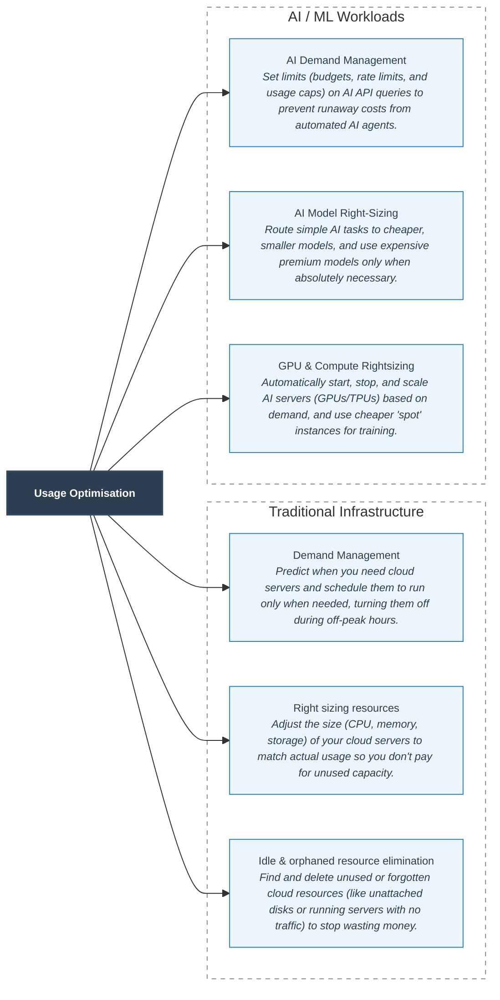
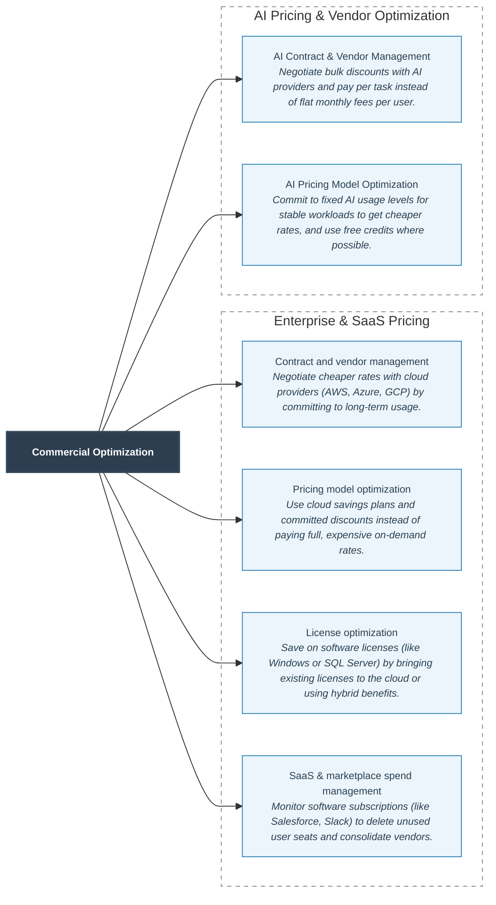
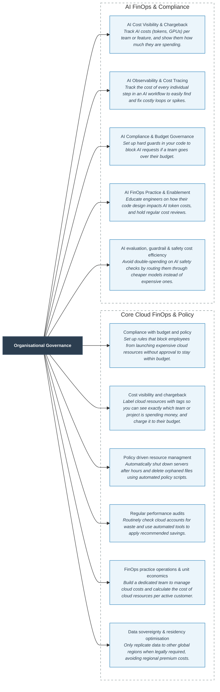

# Extracted Levers Data

This file contains the complete, raw data extracted from the spreadsheet screenshots, along with an **Easy Explanation** column to simplify the technical concepts. There are **43 populated levers** spanning from Row 4 to Row 46, classified under three categories: `Usage Optimisation`, `Cost effective archtitecture` (sic), and `Organisational governance`.

## Overview of Color Coding (Legend)

* **★ NEW** (Light Green): Indicates a brand new lever.
* **New traditional lever (FinOps 2024-25 / CSP)** (Light Blue/Purple): Indicates a new traditional lever.
* **Updated (UPD)** (Light Yellow/Brown): Indicates an updated traditional lever.

---

## Levers Table

| Row | Category | Lever | Lever (short) | Lever description | Easy Explanation | Classification (Status) |
|---|---|---|---|---|---|---|
| **4** | Usage Optimisation | Demand Management | Demand Management | Implement demand forecasting and capacity planning to align resource allocation with actual business needs, reducing wasted capacity. Leverage AI/ML-driven predictive scaling (AWS Predictive Auto Scaling, Azure Predictive Autoscaling) and AIOps-powered workload forecasting to move from reactive to proactive demand management. Apply intelligent scheduling to shift batch workloads to off-peak windows and low-cost regions automatically. | Predict when you need cloud servers and schedule them to run only when needed, turning them off during off-peak hours. | Updated (UPD) |
| **5** | Usage Optimisation | Right sizing resources | Right sizing resources | Adjust CPU, memory, and storage based on utilisation metrics to match actual demand without over-provisioning. Leverage AI-powered rightsizing recommendations from native CSP tools: AWS Compute Optimizer (ML-based, covers EC2/ECS/Lambda/RDS), Azure Advisor AI, and GCP Active Assist Recommender. Expand rightsizing scope to include ARM/Graviton instances (up to 40% cheaper than x86 equivalents for compatible workloads) and GPU/accelerated compute rightsizing for AI and ML *[Note: Cut off at end of cell]* | Adjust the size (CPU, memory, storage) of your cloud servers to match actual usage so you don't pay for unused capacity. | Updated (UPD) |
| **6** | Usage Optimisation | Idle & orphaned resource elimination | Waste elimination | Identify and eliminate zombie cloud resources: idle VMs running with <5% CPU utilisation, unattached storage volumes and disks, orphaned snapshots and AMIs, unused load balancers with no healthy targets, unused Elastic IPs, idle NAT gateways, and empty resource groups. Industry benchmarks show idle/orphaned resources represent 30-35% of total cloud waste. Implement automated detection policies (AWS Compute Optimizer, Azure Advisor, GCP Recommender) with auto-remediation guardrails. Schedule *[Note: Cut off at end of cell]* | Find and delete unused or forgotten cloud resources (like unattached disks or running servers with no traffic) to stop wasting money. | ★ NEW |
| **7** | Usage Optimisation | AI Demand Management | AI demand management | Apply token budgets, per-workflow iteration caps, rate limits, and cost alerting to align AI resource consumption with actual business need – preventing runaway agentic loops and unpredictable spend without requiring architectural change. Separate production token pools from R&D/experimentation pools with distinct business-owner accountability. | Set limits (budgets, rate limits, and usage caps) on AI API queries to prevent runaway costs from automated AI agents. | New traditional lever |
| **8** | Usage Optimisation | AI Model Right-Sizing | AI model right-sizing | Route each inference to the smallest model that meets quality requirements. Default to economy tier; gate escalation to frontier models on confidence scoring or structured output validation. Domain-specific fine-tuned models match frontier quality at 60% lower inference cost for repetitive tasks. Self-host only where volume is stable and high – underutilised self-hosted GPUs flip the economics back toward managed APIs. | Route simple AI tasks to cheaper, smaller models, and use expensive premium models only when absolutely necessary. | New traditional lever |
| **9** | Usage Optimisation | GPU & Compute Rightsizing | GPU & compute rightsizing | Auto-scale GPU/TPU clusters to match actual AI demand – avoid static over-provisioned clusters that pay for idle capacity. Automate idle job shutdown during off-hours and non-peak periods. Deploy quantized models (INT8, INT4) to reduce memory footprint by 50-75% with minimal quality impact – enabling larger models on smaller GPU configurations. Use spot/preemptible instances for training runs and batch inference (60-80% cost reduction vs on-demand). | Automatically start, stop, and scale AI servers (GPUs/TPUs) based on demand, and use cheaper "spot" instances for training. | New traditional lever |
| **10** | Cost effective archtitecture | Architectural efficiency | Architectural efficiency | Optimise application design using serverless, containerisation, and microservices to reduce unnecessary resource usage and costs. Incorporate FinOps-aware architecture reviews at design stage – cost estimation in CI/CD pipelines (Infracost, AWS Cost Estimator) prevents expensive architectural decisions from reaching production. Evaluate ARM/Graviton migration as an architectural decision across fleets. Shift workloads to managed services that eliminate the cost of idle resource *[Note: Cut off at end of cell]* | Design software using modern cloud methods (like serverless) that only consume resources and cost money when actively running. | Updated (UPD) |
| **11** | Cost effective archtitecture | Network optimization | Network optimization | Optimise data transfer costs – now the #3 cloud cost driver for data-intensive workloads – by designing network architectures that minimise cross-region and cross-AZ data transfers. Prioritise: (1) VPC endpoint optimisation – PrivateLink eliminates data transfer charges for traffic to AWS/Azure/GCP services that would otherwise traverse the internet; (2) Data egress optimisation – audit and restructure data pipelines to keep data in-region and use CDN for static content delivery (50-70% cheaper); *[Note: Cut off at end of cell]* | Design your cloud network to keep data transfers local, avoiding expensive charges for moving data between different regions or zones. | Updated (UPD) |
| **12** | Cost effective archtitecture | Storage and data management | Storage & data mgmt. | Implement data tiering and lifecycle policies to manage storage cost-effectively. Leverage intelligent auto-tiering: AWS S3 Intelligent-Tiering (automatic, no retrieval fees, no minimum duration), Azure Blob Smart Tiering, GCP Autoclass – eliminate manual lifecycle rule management for unknown or changing access patterns. Apply automated lifecycle policies to object storage, enforcing transitions to Infrequent Access and Archive tiers at defined ages. Optimise snapshot cadence and cross-region backup *[Note: Cut off at end of cell]* | Automatically move older, rarely accessed files to cheaper, slow storage tiers and regularly delete old backups. | Updated (UPD) |
| **13** | Cost effective archtitecture | Kubernetes & container cost optimisation | K8s cost optimisation | Optimise costs for Kubernetes-based workloads – now the dominant enterprise compute platform and the #1 FinOps cost management challenge per the FinOps Foundation 2024 State of FinOps report. Key levers: (1) Node rightsizing and bin-packing: use Karpenter (AWS) or GKE Autopilot to dynamically provision right-sized nodes matching actual pod requests; (2) Spot/Preemptible node pools for stateless and fault-tolerant workloads (up to 90% savings); (3) Resource request/limit tuning: fix over-requested pods *[Note: Cut off at end of cell]* | Automatically scale container clusters up or down based on actual usage, and fix settings for oversized applications. | ★ NEW |
| **14** | Cost effective archtitecture | Sustainability & carbon efficiency | Sustainability | Optimise cloud workloads for carbon efficiency and energy use – now a board-level requirement under CSRD (EU) and SEC climate disclosure rules (US). Leverage carbon-aware computing: shift flexible batch workloads to lower-carbon regions or lower-carbon time windows using AWS Customer Carbon Footprint Tool, Azure Emissions Impact Dashboard, and GCP Carbon Footprint. Implement Carbonaware SDK for time- and region-shifting of interruptible workloads. Prioritise ARM/Graviton instances (30-40% more *[Note: Cut off at end of cell]* | Run heavy, flexible computing tasks in regions or at times of day when cleaner, renewable energy is most available. | ★ NEW |
| **15** | Cost effective archtitecture | Database & query optimisation | Database & query opt. | Optimise database spend across engine and compute-model choice (managed vs self-managed, relational vs purpose-built, serverless), instance and storage rightsizing, read/write and replica efficiency, query performance, and read-offload caching. Databases are among the largest and least-optimised cost categories. Covers RDS/Aurora, Cloud SQL/AlloyDB/Spanner, Azure SQL/Cosmos DB, and DynamoDB. | Optimize database setups, cache frequent queries, and choose the most cost-effective database type for your needs. | ★ NEW |
| **16** | Cost effective archtitecture | Resiliency & BCDR rationalisation | Resiliency & BCDR | Right-size disaster-recovery and high-availability spend to actual business RTO/RPO – resilience overbuild is a common, large, invisible cost. Covers DR strategy tiering (backup-restore / pilot-light / warm-standby / multi-site), elimination of over-provisioned standby capacity, backup retention and replication-scope review, and multi-AZ/multi-region cost differentiated by application criticality. | Avoid overpaying for disaster recovery by matching backup and redundancy systems to actual business recovery needs. | ★ NEW |
| **17** | Cost effective archtitecture | Data & analytics platform optimisation | Data & analytics platform | Optimise data-warehouse, big-data processing, streaming, and ETL spend – a fast-growing, frequently unoptimised category. Covers warehouse rightsizing and auto-suspend (Redshift/BigQuery/Synapse/Snowflake), query and scan cost reduction (partitioning, materialised views, result caching), spot/transient processing clusters (EMR/Dataproc/HDInsight), serverless analytics, and streaming throughput rightsizing. | Optimize big data tools (like Snowflake or BigQuery) by setting them to auto-suspend when idle and partitioning data for cheaper scans. | ★ NEW |
| **18** | Cost effective archtitecture | Observability & telemetry cost optimisation | Observability cost | Control the cost of logging, metrics, tracing, and security telemetry – an increasingly material hidden spend. Covers log ingestion filtering and sampling, retention tiering and archival, custom-metric cardinality reduction, distributed-trace sampling, deduplication of overlapping telemetry pipelines (including duplicated security-tool feeds), and rationalisation of third-party observability platforms. | Filter and sample log files so you only store useful monitoring data, avoiding massive storage bills for useless system logs. | ★ NEW |
| **19** | Cost effective archtitecture | Serverless & event-driven cost optimisation | Serverless & event cost | Close the serverless and event-driven cost traps that scale silently with usage. Covers function memory/duration rightsizing (Lambda/Functions/Cloud Functions), invocation and concurrency control, orchestration cost (Step Functions/Logic Apps state transitions), API-gateway request cost, and event/queue volume (EventBridge/SQS/SNS/Pub-Sub/Event Grid). | Tune serverless functions (like AWS Lambda) so they use just enough memory and do not run longer than necessary. | ★ NEW |
| **20** | Cost effective archtitecture | End-user computing & VDI optimisation | End-user computing / VDI | Optimise virtual-desktop and app-streaming spend – per-user/per-hour billing makes this a quiet, recurring waste pocket. Covers idle desktop deprovisioning, AutoStop vs AlwaysOn running modes and off-peak session-host scaling, bundle/instance rightsizing, and licensing-model selection across Amazon WorkSpaces, Azure Virtual Desktop, and Google Cloud Workstations. | Automatically shut down virtual desktops when employees log off, and right-size the virtual machines they use. | ★ NEW |
| **21** | Cost effective archtitecture | AI Inference Routing Architecture | AI inference routing | Design workload routing between real-time and batch processing based on SLA constraints. Core principle: never default to real-time for asynchronous workloads – batch APIs deliver 50% cost savings. Three SLA tiers: (1) <30 min SLA -> real-time Messages API (Urgent Exceptions, high cost); (2) Standard monthly/overnight -> Batch API queue (50% saving); (3) Continuous arrival with 30h SLA -> 6-hour batch windows. Real-time should be an explicit opt-in with justification, not the default path. | Route non-urgent AI tasks to slower "batch" processing queues to save 50% on cost compared to instant responses. | New traditional lever |
| **22** | Cost effective archtitecture | Context Engineering Architecture | Context engineering | The highest-impact AI cost lever – context size is a direct multiplier on every token bill. Five key architecture patterns: (1) RAG precision: serve only relevant pages, not full documents – 40-page doc pruned to 3-5 pages yields 80% token reduction with no quality loss; (2) Session compression: summarise resolved turns into narrative, preserving verbatim history only for the active unresolved issue; (3) Scratchpad pattern: agent maintains a structured Scratchpad.md in 30+ min exploration sessions to prevent token *[Note: Cut off at end of cell]* | Send less text to AI models (by using smart search and summaries) because larger inputs directly multiply your API bill. | New traditional lever |
| **23** | Cost effective archtitecture | Agentic System Architecture | Agentic architecture | Multi-agent design choices compound token cost at scale. Five validated patterns: (1) Shared vector store: subagents index outputs into shared store; subsequent agents retrieve via semantic search – daisy-chaining full conversation logs scales token costs exponentially; (2) Goal-oriented delegation: delegate target outcome and quality criteria, not procedural steps – procedural micromanagement causes rigid failure on emerging topics; (3) Granular MCP tools: split monolithic tools into single-purpose *[Note: Cut off at end of cell]* | Design AI agents to share resources and direct goals efficiently instead of micro-managing them with repetitive steps. | New traditional lever |
| **24** | Cost effective archtitecture | Schema & Extraction Architecture | Schema architecture | Structural design of extraction pipelines determines accuracy, retry cost, and human review load. Six key patterns: (1) Resilient schemas: catch-all enum value with detail string field – handles edge cases without continuous schema changes; (2) Schema redundancy: capture calculated_total and stated_total separately – flag for human review only on mismatch; (3) Null handling: explicit 'return null if not stated' prevents plausible hallucinations in nullable fields; (4) Confidence-based human-in-the-loop: automate >90% *[Note: Cut off at end of cell]* | Structure how AI retrieves and formats information so it doesn't make mistakes or require costly retries. | New traditional lever |
| **25** | Cost effective archtitecture | AI Gateway & Model Routing Infrastructure | AI gateway | Deploy an AI gateway as the central control plane for policy enforcement, usage tracking, rate-limiting, prompt caching, and model routing across all AI workloads. The gateway provides the observability layer that makes all other optimisation levers measurable. Key capabilities: semantic caching for repeated queries (20-40% cache hit rates in production = zero inference cost); prompt caching on static components (up to 90% discount on cached input tokens); model garden with transparent price-performance *[Note: Cut off at end of cell]* | Use a central gateway to track AI costs, save answers to repeat questions (caching), and route tasks to the cheapest model. | New traditional lever |
| **26** | Cost effective archtitecture | Vector & Embedding Optimisation | Vector & embedding opt. | Right-size embedding models – smaller dimensions reduce both compute cost and vector DB storage and query cost where retrieval quality permits. Implement hot/cold vector DB tiering with usage-decay eviction policies. Cache embeddings for stable documents to avoid re-embedding entire corpora on each agent run – recompute only on change events. Use hybrid sparse-dense retrieval: sparse (BM25) retrieval is near-zero cost and can pre-filter candidates before expensive vector search. Right-size vector DB *[Note: Cut off at end of cell]* | Use smaller AI representation files (embeddings) and store them in cheaper database tiers when not actively used. | New traditional lever |
| **27** | Cost effective archtitecture | AI Data & Model Lifecycle Management | Al data & model lifecycle | Manage the full lifecycle of AI data assets and model artefacts to prevent storage sprawl. Training data: eliminate duplicate samples (20-30% storage reduction at zero quality cost), compress corpora, enforce data retention policies. Model artefacts: cold-tier legacy fine-tuned models and training checkpoints not actively serving production traffic; archive GenAI inference logs with tuned retention windows. Implement model version governance – prevent accumulation of experimental fine-tuned variants *[Note: Cut off at end of cell]* | Clean up AI training data by deleting duplicates, and archive old AI model versions that are no longer used. | New traditional lever |
| **28** | Cost effective archtitecture | ML platform & MLOps cost optimisation | ML platform & MLOps | Optimise managed-ML-platform spend – distinct from GenAI tokens and raw GPU. Covers idle notebook instances, always-on inference endpoints serving near-zero traffic, training and hyperparameter-tuning job rightsizing, and feature-store / model-registry storage sprawl across SageMaker, Vertex AI, and Azure ML. | Stop running idle machine learning notebooks and clean up registries to save on development costs. | ★ NEW |
| **29** | Cost effective archtitecture | Multimodal AI & media generation optimisation | Multimodal & media gen | Optimise multimodal AI cost – image, video, audio, and document/OCR generation and analysis – which bills very differently from text tokens (per-image, per-second-of-video, per-page, resolution/quality tiers). Covers media input reduction (resolution, frame/segment sampling), model and modality routing (specialist vs premium multimodal, batch vs real-time), and media caching / derived-asset reuse. | Reduce the size of images/video/audio sent to AI models, and reuse generated assets to save on high media-processing fees. | ★ NEW |
| **30** | Commercial optimization | Contract and vendor management | Contract & vendor mgmt. | Negotiate better terms with cloud providers, focusing on discounts for long-term commitments and flexibility. Leverage: MACC (Microsoft Azure Consumption Commitments) and MOSA structures for enterprise Azure agreements; AWS Enterprise Discount Programme (EDP); GCP Committed Use Discount programmes. Explore private marketplace pricing agreements for ISV software purchased through AWS/Azure/GCP marketplaces. Implement multi-cloud vendor strategy using negotiation leverage from *[Note: Cut off at end of cell]* | Negotiate cheaper rates with cloud providers (AWS, Azure, GCP) by committing to long-term usage. | Updated (UPD) |
| **31** | Commercial optimization | Pricing model optimization | Pricing model optim. | Leverage the full spectrum of committed pricing to reduce on-demand spend. Updated 2025 guidance: AWS Compute Savings Plans are now preferred over Reserved Instances for variable compute – they apply automatically across instance families, sizes, and regions (up to 66% saving vs on-demand). Use AWS EC2 Instance Savings Plans for maximum discount on specific families. GCP Committed Use Discounts (CUDs) cover compute, memory-optimised, and GPU workloads. Azure Savings Plan for Compute *[Note: Cut off at end of cell]* | Use cloud savings plans and committed discounts instead of paying full, expensive on-demand rates. | Updated (UPD) |
| **32** | Commercial optimization | License optimization | License optimisation | Reduce licensing costs through BYOL (Bring Your Own License) programmes and hybrid benefit schemes. Key levers: (1) Azure Hybrid Benefit: apply existing Windows Server and SQL Server licences to Azure VMs and AKS – saves up to 85% on Windows VMs; (2) AWS License Mobility: bring eligible Microsoft software to AWS EC2 Dedicated Hosts; (3) SQL Server on Azure: migrate to Azure SQL Managed Instance to consolidate licensing under Azure Hybrid Benefit; (4) Oracle licence optimisation on cloud: audit vCPU *[Note: Cut off at end of cell]* | Save on software licenses (like Windows or SQL Server) by bringing existing licenses to the cloud or using hybrid benefits. | ★ NEW |
| **33** | Commercial optimization | SaaS & marketplace spend management | SaaS & marketplace | Extend FinOps disciplines to SaaS applications and cloud marketplace purchases – now a formal FinOps Foundation 2024-25 scope as SaaS spend typically represents 20-30% of total technology spend. Key levers: (1) SaaS licence rationalisation: audit seat utilisation and eliminate unused licences (average enterprise has 30%+ unused SaaS seats); (2) Negotiate marketplace private pricing agreements for high-volume ISV software; (3) Consolidate SaaS vendors to reduce duplication; (4) Apply chargeback *[Note: Cut off at end of cell]* | Monitor software subscriptions (like Salesforce, Slack) to delete unused user seats and consolidate vendors. | ★ NEW |
| **34** | Commercial optimization | AI Contract & Vendor Management | AI contract & vendor mgmt. | Negotiate AI provider agreements with volume discounts, outcome-based pricing, and CSP credit alignment. Multi-year volume commitments justify 30-70% discounts. Push SaaS AI vendors from per-seat to usage/outcome-based models (per-document, per-decision, per-resolution). Hybrid licensing: seat licenses for heavy daily users, consumption credits for occasional or customer-facing users. Apply CSP credits (Azure MACC, AWS ACO, Google MAP) to AI infrastructure spend before committing to AI- *[Note: Cut off at end of cell]* | Negotiate bulk discounts with AI providers and pay per task instead of paying flat monthly fees per user. | New traditional lever |
| **35** | Commercial optimization | AI Pricing Model Optimization | AI pricing model optim. | Shift AI spend from on-demand to committed pricing as demand patterns stabilise. Sequence: (1) Exhaust batch API savings (50% off) for latency-tolerant workloads – no commitment required; (2) Short-term reservations once usage patterns stabilise; (3) Provisioned Throughput Units (PTUs) only for well-understood, high-volume, stable production workloads – PTUs cap marginal cost and guarantee throughput but require accurate demand forecasting; (4) Reserved GPU/TPU at 30-50% discount for steady *[Note: Cut off at end of cell]* | Commit to fixed AI usage levels for stable workloads to get cheaper rates, and use free credits where possible. | New traditional lever |
| **36** | Organisational governance | Compliance with budget and policy | Compliance | Monitor and enforce compliance with budget constraints and cloud usage policies to avoid cost overruns and ensure financial discipline. Implement multi-cloud budget management to maintain a unified view of spend across AWS, Azure, and GCP. Apply automated policy enforcement with guardrails-as-code (AWS Service Control Policies, Azure Policy, GCP Org Policy) embedded in CI/CD pipelines to prevent non-compliant resource provisioning from reaching production. | Set up rules that block employees from launching expensive cloud resources without approval to stay within budget. | Updated (UPD) |
| **37** | Organisational governance | Cost visibility and chargeback | Visibility & chargeback | Implement detailed tagging and cost allocation tools to ensure visibility into spend per team or project, facilitating chargebacks and accountable budgeting. Adopt the FOCUS standard (FinOps Open Cost and Usage Specification) - the new open billing normalisation format supported by AWS, Azure, GCP, and Oracle for unified multi-cloud cost data. Extend visibility to unit economics: track cost per transaction, per active user, per API call - linking cloud spend directly to business outcomes. | Label cloud resources with tags so you can see exactly which team or project is spending money, and charge it to their budget. | Updated (UPD) |
| **38** | Organisational governance | Policy driven resource managment | Policy driven env. | Enforce governance policies that automate cost optimisation, such as shutting down unused instances and scaling resources based on load. Implement guardrails-as-code: embed policy enforcement directly in CI/CD pipelines using AWS Service Control Policies, Azure Policy with DeployIfNotExists, or GCP Organisation Policies - preventing non-compliant resource provisioning before it reaches production. Deploy automated zombie resource detection and remediation workflows (AWS Config rules + *[Note: Cut off at end of cell]* | Automatically shut down servers after hours and delete orphaned files using automated policy scripts. | Updated (UPD) |
| **39** | Organisational governance | Regular performance audits | Performance audits | Conduct regular reviews and audits to ensure that resources are being used efficiently and adjust as needed based on audit outcomes. Shift from periodic to continuous optimisation: integrate CSP-native advisor outputs (AWS Compute Optimizer, Trusted Advisor, Azure Advisor, GCP Active Assist) into automated workflows with auto-remediation for low-risk recommendations. Implement anomaly-triggered audit cycles - spend anomalies should initiate an immediate root cause review rather than *[Note: Cut off at end of cell]* | Routinely check cloud accounts for waste and use automated tools to apply recommended savings. | Updated (UPD) |
| **40** | Organisational governance | FinOps practice operations & unit economics | FinOps practice ops | Establish and mature the FinOps practice as a formal operating model - now a core FinOps Foundation 2024-25 capability. Key elements: (1) FinOps team structure and RACI: dedicated FinOps practitioner role with cross-functional authority over engineering, finance, and procurement; (2) Unit economics tracking: define and track cost-per-unit KPIs (cost per transaction, per active user, per API call) to link cloud spend to business outcomes and make cost performance visible to engineering *[Note: Cut off at end of cell]* | Build a dedicated team to manage cloud costs and calculate the cost of cloud resources per active customer. | ★ NEW |
| **41** | Organisational governance | Data sovereignty & residency optimisation | Sovereignty & residency | Optimise the cost of meeting data-residency and sovereignty requirements without over-spending – residency premiums are a frequently unexamined cost. Covers right-sizing the regional footprint to actual legal requirements (avoiding unnecessary multi-region replication), data classification to scope residency only where required, sovereign/dedicated-region premium evaluation, and region selection balancing compliance, latency and cost. | Only replicate data to other global regions when legally required, avoiding regional premium costs. | ★ NEW |
| **42** | Organisational governance | AI Cost Visibility & Chargeback | AI visibility & chargeback | Extend cloud FinOps disciplines to AI's unique cost units: tokens, GPU hours, model invocations, reasoning loops. Track blended cost per business outcome (per ticket resolved, per document processed) – not cost per token. Implement tag-based cost allocation to teams, features, and projects. Chargeback where implementable; showback to drive awareness where chargeback is not yet in place. Deploy a centralised AI FinOps dashboard with drill-down by team, application, model, and environment. | Track AI costs (tokens, GPUs) per team or feature, and show them how much they are spending. | New traditional lever |
| **43** | Organisational governance | AI Observability & Cost Tracing | AI observability | Instrument per-step token tracing (input, output, and reasoning tokens separately) at every workflow step – aggregate billing obscures compound cost dynamics and makes root cause analysis of cost spikes impossible. Integrate with AI observability platforms (Arize, Langfuse, Datadog LLM Observability, Helicone) for real-time per-request cost tracing, latency profiling, and quality monitoring. Implement automated anomaly detection on AI spend to alert before runaway agentic loops exhaust monthly *[Note: Cut off at end of cell]* | Track the cost of every individual step in an AI workflow to easily find and fix costly loops or spikes. | New traditional lever |
| **44** | Organisational governance | AI Compliance & Budget Governance | AI compliance | Enforce AI usage policies, model guardrails, spending caps, and automated enforcement. Critical architecture principle: zero-tolerance compliance rules must be enforced via application-layer intercepts that block and escalate server-side – prompt-only enforcement yields persistent 3% failure rate on hard limits. Maintain agentic workflow registry documenting all agents in production (30-50% build cost saving by preventing duplicates). | Set up hard guards in your code to block AI requests if a team goes over their budget. | New traditional lever |
| **45** | Organisational governance | AI FinOps Practice & Enablement | AI FinOps practice | Monthly utilisation reviews; quota enforcement per team, application, and Embed AI cost awareness through developer enablement, prompt efficiency programmes, and model selection guidelines surfaced at point-of-use. Train engineering teams on architecture patterns that drive token consumption – context engineering, routing architecture, MCP tool design, and agentic memory architecture are engineering disciplines that determine cost at design time. Establish an AI FinOps function with accountability for cost-per-outcome targets. Conduct regular AI workflow cost audits to identify *[Note: Cut off at end of cell]* | Educate engineers on how their code design impacts AI token costs, and hold regular cost reviews. | New traditional lever |
| **46** | Organisational governance | AI evaluation, guardrail & safety cost efficiency | AI eval & guardrail cost | Control the inference cost of evaluation, guardrails, and safety – a fast-growing hidden AI cost. Covers evaluation sampling and prioritisation (LLM-as-judge can double inference cost), guardrail routing and policy tiering (premium models used for simple checks, duplicate guardrail calls across agent steps), and test-set lifecycle with explicit eval cost attribution. | Avoid double-spending on AI safety checks by routing them through cheaper models instead of expensive ones. | ★ NEW |

---

## Detailed Row View

Below is the full text of all rows, exactly as displayed in the images, along with the **Easy Explanation**:

### **Row 4**

* **Category**: `Usage Optimisation`
* **Lever**: `Demand Management`
* **Lever (short)**: `Demand Management`
* **Lever description**: `Implement demand forecasting and capacity planning to align resource allocation with actual business needs, reducing wasted capacity. Leverage AI/ML-driven predictive scaling (AWS Predictive Auto Scaling, Azure Predictive Autoscaling) and AIOps-powered workload forecasting to move from reactive to proactive demand management. Apply intelligent scheduling to shift batch workloads to off-peak windows and low-cost regions automatically.`
* **Easy Explanation**: Predict when you need cloud servers and schedule them to run only when needed, turning them off during off-peak hours.
* **Classification**: `Updated` (Yellow)

### **Row 5**

* **Category**: `Usage Optimisation`
* **Lever**: `Right sizing resources`
* **Lever (short)**: `Right sizing resources`
* **Lever description**: `Adjust CPU, memory, and storage based on utilisation metrics to match actual demand without over-provisioning. Leverage AI-powered rightsizing recommendations from native CSP tools: AWS Compute Optimizer (ML-based, covers EC2/ECS/Lambda/RDS), Azure Advisor AI, and GCP Active Assist Recommender. Expand rightsizing scope to include ARM/Graviton instances (up to 40% cheaper than x86 equivalents for compatible workloads) and GPU/accelerated compute rightsizing for AI and ML` *(Note: ends abruptly with "rightsizing for AI and ML" without a period due to truncation).*
* **Easy Explanation**: Adjust the size (CPU, memory, storage) of your cloud servers to match actual usage so you don't pay for unused capacity.
* **Classification**: `Updated` (Yellow)

### **Row 6**

* **Category**: `Usage Optimisation`
* **Lever**: `Idle & orphaned resource elimination`
* **Lever (short)**: `Waste elimination`
* **Lever description**: `Identify and eliminate zombie cloud resources: idle VMs running with <5% CPU utilisation, unattached storage volumes and disks, orphaned snapshots and AMIs, unused load balancers with no healthy targets, unused Elastic IPs, idle NAT gateways, and empty resource groups. Industry benchmarks show idle/orphaned resources represent 30-35% of total cloud waste. Implement automated detection policies (AWS Compute Optimizer, Azure Advisor, GCP Recommender) with auto-remediation guardrails. Schedule` *(Note: ends abruptly with "Schedule" without a period due to truncation).*
* **Easy Explanation**: Find and delete unused or forgotten cloud resources (like unattached disks or running servers with no traffic) to stop wasting money.
* **Classification**: `★ NEW` (Green)

### **Row 7**

* **Category**: `Usage Optimisation`
* **Lever**: `AI Demand Management`
* **Lever (short)**: `AI demand management`
* **Lever description**: `Apply token budgets, per-workflow iteration caps, rate limits, and cost alerting to align AI resource consumption with actual business need – preventing runaway agentic loops and unpredictable spend without requiring architectural change. Separate production token pools from R&D/experimentation pools with distinct business-owner accountability.`
* **Easy Explanation**: Set limits (budgets, rate limits, and usage caps) on AI API queries to prevent runaway costs from automated AI agents.
* **Classification**: `New traditional lever` (Blue/Purple)

### **Row 8**

* **Category**: `Usage Optimisation`
* **Lever**: `AI Model Right-Sizing`
* **Lever (short)**: `AI model right-sizing`
* **Lever description**: `Route each inference to the smallest model that meets quality requirements. Default to economy tier; gate escalation to frontier models on confidence scoring or structured output validation. Domain-specific fine-tuned models match frontier quality at 60% lower inference cost for repetitive tasks. Self-host only where volume is stable and high – underutilised self-hosted GPUs flip the economics back toward managed APIs.`
* **Easy Explanation**: Route simple AI tasks to cheaper, smaller models, and use expensive premium models only when absolutely necessary.
* **Classification**: `New traditional lever` (Blue/Purple)

### **Row 9**

* **Category**: `Usage Optimisation`
* **Lever**: `GPU & Compute Rightsizing`
* **Lever (short)**: `GPU & compute rightsizing`
* **Lever description**: `Auto-scale GPU/TPU clusters to match actual AI demand – avoid static over-provisioned clusters that pay for idle capacity. Automate idle job shutdown during off-hours and non-peak periods. Deploy quantized models (INT8, INT4) to reduce memory footprint by 50-75% with minimal quality impact – enabling larger models on smaller GPU configurations. Use spot/preemptible instances for training runs and batch inference (60-80% cost reduction vs on-demand).`
* **Easy Explanation**: Automatically start, stop, and scale AI servers (GPUs/TPUs) based on demand, and use cheaper "spot" instances for training.
* **Classification**: `New traditional lever` (Blue/Purple)

### **Row 10**

* **Category**: `Cost effective archtitecture`
* **Lever**: `Architectural efficiency`
* **Lever (short)**: `Architectural efficiency`
* **Lever description**: `Optimise application design using serverless, containerisation, and microservices to reduce unnecessary resource usage and costs. Incorporate FinOps-aware architecture reviews at design stage – cost estimation in CI/CD pipelines (Infracost, AWS Cost Estimator) prevents expensive architectural decisions from reaching production. Evaluate ARM/Graviton migration as an architectural decision across fleets. Shift workloads to managed services that eliminate the cost of idle resource` *(Note: ends abruptly with "resource" without a period due to truncation).*
* **Easy Explanation**: Design software using modern cloud methods (like serverless) that only consume resources and cost money when actively running.
* **Classification**: `Updated` (Yellow)

### **Row 11**

* **Category**: `Cost effective archtitecture`
* **Lever**: `Network optimization`
* **Lever (short)**: `Network optimization`
* **Lever description**: `Optimise data transfer costs – now the #3 cloud cost driver for data-intensive workloads – by designing network architectures that minimise cross-region and cross-AZ data transfers. Prioritise: (1) VPC endpoint optimisation – PrivateLink eliminates data transfer charges for traffic to AWS/Azure/GCP services that would otherwise traverse the internet; (2) Data egress optimisation – audit and restructure data pipelines to keep data in-region and use CDN for static content delivery (50-70% cheaper);` *(Note: ends with a semicolon due to truncation).*
* **Easy Explanation**: Design your cloud network to keep data transfers local, avoiding expensive charges for moving data between different regions or zones.
* **Classification**: `Updated` (Yellow)

### **Row 12**

* **Category**: `Cost effective archtitecture`
* **Lever**: `Storage and data management`
* **Lever (short)**: `Storage & data mgmt.`
* **Lever description**: `Implement data tiering and lifecycle policies to manage storage cost-effectively. Leverage intelligent auto-tiering: AWS S3 Intelligent-Tiering (automatic, no retrieval fees, no minimum duration), Azure Blob Smart Tiering, GCP Autoclass – eliminate manual lifecycle rule management for unknown or changing access patterns. Apply automated lifecycle policies to object storage, enforcing transitions to Infrequent Access and Archive tiers at defined ages. Optimise snapshot cadence and cross-region backup` *(Note: ends abruptly with "backup" without a period due to truncation).*
* **Easy Explanation**: Automatically move older, rarely accessed files to cheaper, slow storage tiers and regularly delete old backups.
* **Classification**: `Updated` (Yellow)

### **Row 13**

* **Category**: `Cost effective archtitecture`
* **Lever**: `Kubernetes & container cost optimisation`
* **Lever (short)**: `K8s cost optimisation`
* **Lever description**: `Optimise costs for Kubernetes-based workloads – now the dominant enterprise compute platform and the #1 FinOps cost management challenge per the FinOps Foundation 2024 State of FinOps report. Key levers: (1) Node rightsizing and bin-packing: use Karpenter (AWS) or GKE Autopilot to dynamically provision right-sized nodes matching actual pod requests; (2) Spot/Preemptible node pools for stateless and fault-tolerant workloads (up to 90% savings); (3) Resource request/limit tuning: fix over-requested pods` *(Note: ends abruptly with "pods" without a period due to truncation).*
* **Easy Explanation**: Automatically scale container clusters up or down based on actual usage, and fix settings for oversized applications.
* **Classification**: `★ NEW` (Green)

### **Row 14**

* **Category**: `Cost effective archtitecture`
* **Lever**: `Sustainability & carbon efficiency`
* **Lever (short)**: `Sustainability`
* **Lever description**: `Optimise cloud workloads for carbon efficiency and energy use – now a board-level requirement under CSRD (EU) and SEC climate disclosure rules (US). Leverage carbon-aware computing: shift flexible batch workloads to lower-carbon regions or lower-carbon time windows using AWS Customer Carbon Footprint Tool, Azure Emissions Impact Dashboard, and GCP Carbon Footprint. Implement Carbonaware SDK for time- and region-shifting of interruptible workloads. Prioritise ARM/Graviton instances (30-40% more` *(Note: ends abruptly with "more" without a period due to truncation).*
* **Easy Explanation**: Run heavy, flexible computing tasks in regions or at times of day when cleaner, renewable energy is most available.
* **Classification**: `★ NEW` (Green)

### **Row 15**

* **Category**: `Cost effective archtitecture`
* **Lever**: `Database & query optimisation`
* **Lever (short)**: `Database & query opt.`
* **Lever description**: `Optimise database spend across engine and compute-model choice (managed vs self-managed, relational vs purpose-built, serverless), instance and storage rightsizing, read/write and replica efficiency, query performance, and read-offload caching. Databases are among the largest and least-optimised cost categories. Covers RDS/Aurora, Cloud SQL/AlloyDB/Spanner, Azure SQL/Cosmos DB, and DynamoDB.`
* **Easy Explanation**: Optimize database setups, cache frequent queries, and choose the most cost-effective database type for your needs.
* **Classification**: `★ NEW` (Green)

### **Row 16**

* **Category**: `Cost effective archtitecture`
* **Lever**: `Resiliency & BCDR rationalisation`
* **Lever (short)**: `Resiliency & BCDR`
* **Lever description**: `Right-size disaster-recovery and high-availability spend to actual business RTO/RPO – resilience overbuild is a common, large, invisible cost. Covers DR strategy tiering (backup-restore / pilot-light / warm-standby / multi-site), elimination of over-provisioned standby capacity, backup retention and replication-scope review, and multi-AZ/multi-region cost differentiated by application criticality.`
* **Easy Explanation**: Avoid overpaying for disaster recovery by matching backup and redundancy systems to actual business recovery needs.
* **Classification**: `★ NEW` (Green)

### **Row 17**

* **Category**: `Cost effective archtitecture`
* **Lever**: `Data & analytics platform optimisation`
* **Lever (short)**: `Data & analytics platform`
* **Lever description**: `Optimise data-warehouse, big-data processing, streaming, and ETL spend – a fast-growing, frequently unoptimised category. Covers warehouse rightsizing and auto-suspend (Redshift/BigQuery/Synapse/Snowflake), query and scan cost reduction (partitioning, materialised views, result caching), spot/transient processing clusters (EMR/Dataproc/HDInsight), serverless analytics, and streaming throughput rightsizing.`
* **Easy Explanation**: Optimize big data tools (like Snowflake or BigQuery) by setting them to auto-suspend when idle and partitioning data for cheaper scans.
* **Classification**: `★ NEW` (Green)

### **Row 18**

* **Category**: `Cost effective archtitecture`
* **Lever**: `Observability & telemetry cost optimisation`
* **Lever (short)**: `Observability cost`
* **Lever description**: `Control the cost of logging, metrics, tracing, and security telemetry – an increasingly material hidden spend. Covers log ingestion filtering and sampling, retention tiering and archival, custom-metric cardinality reduction, distributed-trace sampling, deduplication of overlapping telemetry pipelines (including duplicated security-tool feeds), and rationalisation of third-party observability platforms.`
* **Easy Explanation**: Filter and sample log files so you only store useful monitoring data, avoiding massive storage bills for useless system logs.
* **Classification**: `★ NEW` (Green)

### **Row 19**

* **Category**: `Cost effective archtitecture`
* **Lever**: `Serverless & event-driven cost optimisation`
* **Lever (short)**: `Serverless & event cost`
* **Lever description**: `Close the serverless and event-driven cost traps that scale silently with usage. Covers function memory/duration rightsizing (Lambda/Functions/Cloud Functions), invocation and concurrency control, orchestration cost (Step Functions/Logic Apps state transitions), API-gateway request cost, and event/queue volume (EventBridge/SQS/SNS/Pub-Sub/Event Grid).`
* **Easy Explanation**: Tune serverless functions (like AWS Lambda) so they use just enough memory and do not run longer than necessary.
* **Classification**: `★ NEW` (Green)

### **Row 20**

* **Category**: `Cost effective archtitecture`
* **Lever**: `End-user computing & VDI optimisation`
* **Lever (short)**: `End-user computing / VDI`
* **Lever description**: `Optimise virtual-desktop and app-streaming spend – per-user/per-hour billing makes this a quiet, recurring waste pocket. Covers idle desktop deprovisioning, AutoStop vs AlwaysOn running modes and off-peak session-host scaling, bundle/instance rightsizing, and licensing-model selection across Amazon WorkSpaces, Azure Virtual Desktop, and Google Cloud Workstations.`
* **Easy Explanation**: Automatically shut down virtual desktops when employees log off, and right-size the virtual machines they use.
* **Classification**: `★ NEW` (Green)

### **Row 21**

* **Category**: `Cost effective archtitecture`
* **Lever**: `AI Inference Routing Architecture`
* **Lever (short)**: `AI inference routing`
* **Lever description**: `Design workload routing between real-time and batch processing based on SLA constraints. Core principle: never default to real-time for asynchronous workloads – batch APIs deliver 50% cost savings. Three SLA tiers: (1) <30 min SLA -> real-time Messages API (Urgent Exceptions, high cost); (2) Standard monthly/overnight -> Batch API queue (50% saving); (3) Continuous arrival with 30h SLA -> 6-hour batch windows. Real-time should be an explicit opt-in with justification, not the default path.`
* **Easy Explanation**: Route non-urgent AI tasks to slower "batch" processing queues to save 50% on cost compared to instant responses.
* **Classification**: `New traditional lever` (Blue/Purple)

### **Row 22**

* **Category**: `Cost effective archtitecture`
* **Lever**: `Context Engineering Architecture`
* **Lever (short)**: `Context engineering`
* **Lever description**: `The highest-impact AI cost lever – context size is a direct multiplier on every token bill. Five key architecture patterns: (1) RAG precision: serve only relevant pages, not full documents – 40-page doc pruned to 3-5 pages yields 80% token reduction with no quality loss; (2) Session compression: summarise resolved turns into narrative, preserving verbatim history only for the active unresolved issue; (3) Scratchpad pattern: agent maintains a structured Scratchpad.md in 30+ min exploration sessions to prevent token` *(Note: ends abruptly with "prevent token" due to truncation).*
* **Easy Explanation**: Send less text to AI models (by using smart search and summaries) because larger inputs directly multiply your API bill.
* **Classification**: `New traditional lever` (Blue/Purple)

### **Row 23**

* **Category**: `Cost effective archtitecture`
* **Lever**: `Agentic System Architecture`
* **Lever (short)**: `Agentic architecture`
* **Lever description**: `Multi-agent design choices compound token cost at scale. Five validated patterns: (1) Shared vector store: subagents index outputs into shared store; subsequent agents retrieve via semantic search – daisy-chaining full conversation logs scales token costs exponentially; (2) Goal-oriented delegation: delegate target outcome and quality criteria, not procedural steps – procedural micromanagement causes rigid failure on emerging topics; (3) Granular MCP tools: split monolithic tools into single-purpose` *(Note: ends abruptly with "single-purpose" due to truncation).*
* **Easy Explanation**: Design AI agents to share resources and direct goals efficiently instead of micro-managing them with repetitive steps.
* **Classification**: `New traditional lever` (Blue/Purple)

### **Row 24**

* **Category**: `Cost effective archtitecture`
* **Lever**: `Schema & Extraction Architecture`
* **Lever (short)**: `Schema architecture`
* **Lever description**: `Structural design of extraction pipelines determines accuracy, retry cost, and human review load. Six key patterns: (1) Resilient schemas: catch-all enum value with detail string field – handles edge cases without continuous schema changes; (2) Schema redundancy: capture calculated_total and stated_total separately – flag for human review only on mismatch; (3) Null handling: explicit 'return null if not stated' prevents plausible hallucinations in nullable fields; (4) Confidence-based human-in-the-loop: automate >90%` *(Note: ends abruptly with ">90%" due to truncation).*
* **Easy Explanation**: Structure how AI retrieves and formats information so it doesn't make mistakes or require costly retries.
* **Classification**: `New traditional lever` (Blue/Purple)

### **Row 25**

* **Category**: `Cost effective archtitecture`
* **Lever**: `AI Gateway & Model Routing Infrastructure`
* **Lever (short)**: `AI gateway`
* **Lever description**: `Deploy an AI gateway as the central control plane for policy enforcement, usage tracking, rate-limiting, prompt caching, and model routing across all AI workloads. The gateway provides the observability layer that makes all other optimisation levers measurable. Key capabilities: semantic caching for repeated queries (20-40% cache hit rates in production = zero inference cost); prompt caching on static components (up to 90% discount on cached input tokens); model garden with transparent price-performance` *(Note: ends abruptly with "price-performance" due to truncation).*
* **Easy Explanation**: Use a central gateway to track AI costs, save answers to repeat questions (caching), and route tasks to the cheapest model.
* **Classification**: `New traditional lever` (Blue/Purple)

### **Row 26**

* **Category**: `Cost effective archtitecture`
* **Lever**: `Vector & Embedding Optimisation`
* **Lever (short)**: `Vector & embedding opt.`
* **Lever description**: `Right-size embedding models – smaller dimensions reduce both compute cost and vector DB storage and query cost where retrieval quality permits. Implement hot/cold vector DB tiering with usage-decay eviction policies. Cache embeddings for stable documents to avoid re-embedding entire corpora on each agent run – recompute only on change events. Use hybrid sparse-dense retrieval: sparse (BM25) retrieval is near-zero cost and can pre-filter candidates before expensive vector search. Right-size vector DB` *(Note: ends abruptly with "vector DB" due to truncation).*
* **Easy Explanation**: Use smaller AI representation files (embeddings) and store them in cheaper database tiers when not actively used.
* **Classification**: `New traditional lever` (Blue/Purple)

### **Row 27**

* **Category**: `Cost effective archtitecture`
* **Lever**: `AI Data & Model Lifecycle Management`
* **Lever (short)**: `Al data & model lifecycle`
* **Lever description**: `Manage the full lifecycle of AI data assets and model artefacts to prevent storage sprawl. Training data: eliminate duplicate samples (20-30% storage reduction at zero quality cost), compress corpora, enforce data retention policies. Model artefacts: cold-tier legacy fine-tuned models and training checkpoints not actively serving production traffic; archive GenAI inference logs with tuned retention windows. Implement model version governance – prevent accumulation of experimental fine-tuned variants` *(Note: ends abruptly with "variants" due to truncation).*
* **Easy Explanation**: Clean up AI training data by deleting duplicates, and archive old AI model versions that are no longer used.
* **Classification**: `New traditional lever` (Blue/Purple)

### **Row 28**

* **Category**: `Cost effective archtitecture`
* **Lever**: `ML platform & MLOps cost optimisation`
* **Lever (short)**: `ML platform & MLOps`
* **Lever description**: `Optimise managed-ML-platform spend – distinct from GenAI tokens and raw GPU. Covers idle notebook instances, always-on inference endpoints serving near-zero traffic, training and hyperparameter-tuning job rightsizing, and feature-store / model-registry storage sprawl across SageMaker, Vertex AI, and Azure ML.`
* **Easy Explanation**: Stop running idle machine learning notebooks and clean up registries to save on development costs.
* **Classification**: `★ NEW` (Green)

### **Row 29**

* **Category**: `Cost effective archtitecture`
* **Lever**: `Multimodal AI & media generation optimisation`
* **Lever (short)**: `Multimodal & media gen`
* **Lever description**: `Optimise multimodal AI cost – image, video, audio, and document/OCR generation and analysis – which bills very differently from text tokens (per-image, per-second-of-video, per-page, resolution/quality tiers). Covers media input reduction (resolution, frame/segment sampling), model and modality routing (specialist vs premium multimodal, batch vs real-time), and media caching / derived-asset reuse.`
* **Easy Explanation**: Reduce the size of images/video/audio sent to AI models, and reuse generated assets to save on high media-processing fees.
* **Classification**: `★ NEW` (Green)

### **Row 30**

* **Category**: `Commercial optimization`
* **Lever**: `Contract and vendor management`
* **Lever (short)**: `Contract & vendor mgmt.`
* **Lever description**: `Negotiate better terms with cloud providers, focusing on discounts for long-term commitments and flexibility. Leverage: MACC (Microsoft Azure Consumption Commitments) and MOSA structures for enterprise Azure agreements; AWS Enterprise Discount Programme (EDP); GCP Committed Use Discount programmes. Explore private marketplace pricing agreements for ISV software purchased through AWS/Azure/GCP marketplaces. Implement multi-cloud vendor strategy using negotiation leverage from` *(Note: ends abruptly with "leverage from" due to truncation).*
* **Easy Explanation**: Negotiate cheaper rates with cloud providers (AWS, Azure, GCP) by committing to long-term usage.
* **Classification**: `Updated` (Yellow)

### **Row 31**

* **Category**: `Commercial optimization`
* **Lever**: `Pricing model optimization`
* **Lever (short)**: `Pricing model optim.`
* **Lever description**: `Leverage the full spectrum of committed pricing to reduce on-demand spend. Updated 2025 guidance: AWS Compute Savings Plans are now preferred over Reserved Instances for variable compute – they apply automatically across instance families, sizes, and regions (up to 66% saving vs on-demand). Use AWS EC2 Instance Savings Plans for maximum discount on specific families. GCP Committed Use Discounts (CUDs) cover compute, memory-optimised, and GPU workloads. Azure Savings Plan for Compute` *(Note: ends abruptly with "Plan for Compute" due to truncation).*
* **Easy Explanation**: Use cloud savings plans and committed discounts instead of paying full, expensive on-demand rates.
* **Classification**: `Updated` (Yellow)

### **Row 32**

* **Category**: `Commercial optimization`
* **Lever**: `License optimization`
* **Lever (short)**: `License optimisation`
* **Lever description**: `Reduce licensing costs through BYOL (Bring Your Own License) programmes and hybrid benefit schemes. Key levers: (1) Azure Hybrid Benefit: apply existing Windows Server and SQL Server licences to Azure VMs and AKS – saves up to 85% on Windows VMs; (2) AWS License Mobility: bring eligible Microsoft software to AWS EC2 Dedicated Hosts; (3) SQL Server on Azure: migrate to Azure SQL Managed Instance to consolidate licensing under Azure Hybrid Benefit; (4) Oracle licence optimisation on cloud: audit vCPU` *(Note: ends abruptly with "audit vCPU" due to truncation).*
* **Easy Explanation**: Save on software licenses (like Windows or SQL Server) by bringing existing licenses to the cloud or using hybrid benefits.
* **Classification**: `★ NEW` (Green)

### **Row 33**

* **Category**: `Commercial optimization`
* **Lever**: `SaaS & marketplace spend management`
* **Lever (short)**: `SaaS & marketplace`
* **Lever description**: `Extend FinOps disciplines to SaaS applications and cloud marketplace purchases – now a formal FinOps Foundation 2024-25 scope as SaaS spend typically represents 20-30% of total technology spend. Key levers: (1) SaaS licence rationalisation: audit seat utilisation and eliminate unused licences (average enterprise has 30%+ unused SaaS seats); (2) Negotiate marketplace private pricing agreements for high-volume ISV software; (3) Consolidate SaaS vendors to reduce duplication; (4) Apply chargeback` *(Note: ends abruptly with "Apply chargeback" due to truncation).*
* **Easy Explanation**: Monitor software subscriptions (like Salesforce, Slack) to delete unused user seats and consolidate vendors.
* **Classification**: `★ NEW` (Green)

### **Row 34**

* **Category**: `Commercial optimization`
* **Lever**: `AI Contract & Vendor Management`
* **Lever (short)**: `AI contract & vendor mgmt.`
* **Lever description**: `Negotiate AI provider agreements with volume discounts, outcome-based pricing, and CSP credit alignment. Multi-year volume commitments justify 30-70% discounts. Push SaaS AI vendors from per-seat to usage/outcome-based models (per-document, per-decision, per-resolution). Hybrid licensing: seat licenses for heavy daily users, consumption credits for occasional or customer-facing users. Apply CSP credits (Azure MACC, AWS ACO, Google MAP) to AI infrastructure spend before committing to AI-` *(Note: ends abruptly with "committing to AI-" due to truncation).*
* **Easy Explanation**: Negotiate bulk discounts with AI providers and pay per task instead of paying flat monthly fees per user.
* **Classification**: `New traditional lever` (Blue/Purple)

### **Row 35**

* **Category**: `Commercial optimization`
* **Lever**: `AI Pricing Model Optimization`
* **Lever (short)**: `AI pricing model optim.`
* **Lever description**: `Shift AI spend from on-demand to committed pricing as demand patterns stabilise. Sequence: (1) Exhaust batch API savings (50% off) for latency-tolerant workloads – no commitment required; (2) Short-term reservations once usage patterns stabilise; (3) Provisioned Throughput Units (PTUs) only for well-understood, high-volume, stable production workloads – PTUs cap marginal cost and guarantee throughput but require accurate demand forecasting; (4) Reserved GPU/TPU at 30-50% discount for steady` *(Note: ends abruptly with "discount for steady" due to truncation).*
* **Easy Explanation**: Commit to fixed AI usage levels for stable workloads to get cheaper rates, and use free credits where possible.
* **Classification**: `New traditional lever` (Blue/Purple)

### **Row 36**

* **Category**: `Organisational governance`
* **Lever**: `Compliance with budget and policy`
* **Lever (short)**: `Compliance`
* **Lever description**: `Monitor and enforce compliance with budget constraints and cloud usage policies to avoid cost overruns and ensure financial discipline. Implement multi-cloud budget management to maintain a unified view of spend across AWS, Azure, and GCP. Apply automated policy enforcement with guardrails-as-code (AWS Service Control Policies, Azure Policy, GCP Org Policy) embedded in CI/CD pipelines to prevent non-compliant resource provisioning from reaching production.`
* **Easy Explanation**: Set up rules that block employees from launching expensive cloud resources without approval to stay within budget.
* **Classification**: `Updated` (Yellow)

### **Row 37**

* **Category**: `Organisational governance`
* **Lever**: `Cost visibility and chargeback`
* **Lever (short)**: `Visibility & chargeback`
* **Lever description**: `Implement detailed tagging and cost allocation tools to ensure visibility into spend per team or project, facilitating chargebacks and accountable budgeting. Adopt the FOCUS standard (FinOps Open Cost and Usage Specification) - the new open billing normalisation format supported by AWS, Azure, GCP, and Oracle for unified multi-cloud cost data. Extend visibility to unit economics: track cost per transaction, per active user, per API call - linking cloud spend directly to business outcomes.`
* **Easy Explanation**: Label cloud resources with tags so you can see exactly which team or project is spending money, and charge it to their budget.
* **Classification**: `Updated` (Yellow)

### **Row 38**

* **Category**: `Organisational governance`
* **Lever**: `Policy driven resource managment`
* **Lever (short)**: `Policy driven env.`
* **Lever description**: `Enforce governance policies that automate cost optimisation, such as shutting down unused instances and scaling resources based on load. Implement guardrails-as-code: embed policy enforcement directly in CI/CD pipelines using AWS Service Control Policies, Azure Policy with DeployIfNotExists, or GCP Organisation Policies - preventing non-compliant resource provisioning before it reaches production. Deploy automated zombie resource detection and remediation workflows (AWS Config rules +` *(Note: ends with an open parenthesis and plus due to truncation).*
* **Easy Explanation**: Automatically shut down servers after hours and delete orphaned files using automated policy scripts.
* **Classification**: `Updated` (Yellow)

### **Row 39**

* **Category**: `Organisational governance`
* **Lever**: `Regular performance audits`
* **Lever (short)**: `Performance audits`
* **Lever description**: `Conduct regular reviews and audits to ensure that resources are being used efficiently and adjust as needed based on audit outcomes. Shift from periodic to continuous optimisation: integrate CSP-native advisor outputs (AWS Compute Optimizer, Trusted Advisor, Azure Advisor, GCP Active Assist) into automated workflows with auto-remediation for low-risk recommendations. Implement anomaly-triggered audit cycles - spend anomalies should initiate an immediate root cause review rather than` *(Note: ends abruptly with "rather than" due to truncation).*
* **Easy Explanation**: Routinely check cloud accounts for waste and use automated tools to apply recommended savings.
* **Classification**: `Updated` (Yellow)

### **Row 40**

* **Category**: `Organisational governance`
* **Lever**: `FinOps practice operations & unit economics`
* **Lever (short)**: `FinOps practice ops`
* **Lever description**: `Establish and mature the FinOps practice as a formal operating model - now a core FinOps Foundation 2024-25 capability. Key elements: (1) FinOps team structure and RACI: dedicated FinOps practitioner role with cross-functional authority over engineering, finance, and procurement; (2) Unit economics tracking: define and track cost-per-unit KPIs (cost per transaction, per active user, per API call) to link cloud spend to business outcomes and make cost performance visible to engineering` *(Note: ends abruptly with "visible to engineering" due to truncation).*
* **Easy Explanation**: Build a dedicated team to manage cloud costs and calculate the cost of cloud resources per active customer.
* **Classification**: `★ NEW` (Green)

### **Row 41**

* **Category**: `Organisational governance`
* **Lever**: `Data sovereignty & residency optimisation`
* **Lever (short)**: `Sovereignty & residency`
* **Lever description**: `Optimise the cost of meeting data-residency and sovereignty requirements without over-spending – residency premiums are a frequently unexamined cost. Covers right-sizing the regional footprint to actual legal requirements (avoiding unnecessary multi-region replication), data classification to scope residency only where required, sovereign/dedicated-region premium evaluation, and region selection balancing compliance, latency and cost.`
* **Easy Explanation**: Only replicate data to other global regions when legally required, avoiding regional premium costs.
* **Classification**: `★ NEW` (Green)

### **Row 42**

* **Category**: `Organisational governance`
* **Lever**: `AI Cost Visibility & Chargeback`
* **Lever (short)**: `AI visibility & chargeback`
* **Lever description**: `Extend cloud FinOps disciplines to AI's unique cost units: tokens, GPU hours, model invocations, reasoning loops. Track blended cost per business outcome (per ticket resolved, per document processed) – not cost per token. Implement tag-based cost allocation to teams, features, and projects. Chargeback where implementable; showback to drive awareness where chargeback is not yet in place. Deploy a centralised AI FinOps dashboard with drill-down by team, application, model, and environment.`
* **Easy Explanation**: Track AI costs (tokens, GPUs) per team or feature, and show them how much they are spending.
* **Classification**: `New traditional lever` (Blue/Purple)

### **Row 43**

* **Category**: `Organisational governance`
* **Lever**: `AI Observability & Cost Tracing`
* **Lever (short)**: `AI observability`
* **Lever description**: `Instrument per-step token tracing (input, output, and reasoning tokens separately) at every workflow step – aggregate billing obscures compound cost dynamics and makes root cause analysis of cost spikes impossible. Integrate with AI observability platforms (Arize, Langfuse, Datadog LLM Observability, Helicone) for real-time per-request cost tracing, latency profiling, and quality monitoring. Implement automated anomaly detection on AI spend to alert before runaway agentic loops exhaust monthly` *(Note: ends abruptly with "monthly" due to truncation).*
* **Easy Explanation**: Track the cost of every individual step in an AI workflow to easily find and fix costly loops or spikes.
* **Classification**: `New traditional lever` (Blue/Purple)

### **Row 44**

* **Category**: `Organisational governance`
* **Lever**: `AI Compliance & Budget Governance`
* **Lever (short)**: `AI compliance`
* **Lever description**: `Enforce AI usage policies, model guardrails, spending caps, and automated enforcement. Critical architecture principle: zero-tolerance compliance rules must be enforced via application-layer intercepts that block and escalate server-side – prompt-only enforcement yields persistent 3% failure rate on hard limits. Maintain agentic workflow registry documenting all agents in production (30-50% build cost saving by preventing duplicates).`
* **Easy Explanation**: Set up hard guards in your code to block AI requests if a team goes over their budget.
* **Classification**: `New traditional lever` (Blue/Purple)

### **Row 45**

* **Category**: `Organisational governance`
* **Lever**: `AI FinOps Practice & Enablement`
* **Lever (short)**: `AI FinOps practice`
* **Lever description**: `Monthly utilisation reviews; quota enforcement per team, application, and Embed AI cost awareness through developer enablement, prompt efficiency programmes, and model selection guidelines surfaced at point-of-use. Train engineering teams on architecture patterns that drive token consumption – context engineering, routing architecture, MCP tool design, and agentic memory architecture are engineering disciplines that determine cost at design time. Establish an AI FinOps function with accountability for cost-per-outcome targets. Conduct regular AI workflow cost audits to identify` *(Note: ends abruptly with "identify" due to truncation).*
* **Easy Explanation**: Educate engineers on how their code design impacts AI token costs, and hold regular cost reviews.
* **Classification**: `New traditional lever` (Blue/Purple)

### **Row 46**

* **Category**: `Organisational governance`
* **Lever**: `AI evaluation, guardrail & safety cost efficiency`
* **Lever (short)**: `AI eval & guardrail cost`
* **Lever description**: `Control the inference cost of evaluation, guardrails, and safety – a fast-growing hidden AI cost. Covers evaluation sampling and prioritisation (LLM-as-judge can double inference cost), guardrail routing and policy tiering (premium models used for simple checks, duplicate guardrail calls across agent steps), and test-set lifecycle with explicit eval cost attribution.`
* **Easy Explanation**: Avoid double-spending on AI safety checks by routing them through cheaper models instead of expensive ones.
* **Classification**: `★ NEW` (Green)

---

## Horizontal Mermaid Charts

Below are horizontal Mermaid flowcharts visualizing the extracted levers, organized by their respective categories. Related levers within each category are grouped together inside "square buckets" (subgraphs styled with transparent backgrounds and dashed gray borders) to highlight sub-themes.

### 1. Usage Optimisation

### 2. Cost Effective Architecture

```mermaid
graph LR
    cat2["Cost Effective Architecture"]

    subgraph sub_compute ["Infrastructure & Compute"]
        CEA1["Architectural efficiency<br/><i>Design software using modern cloud methods (like serverless) that only consume resources and cost money when actively running.</i>"]
        CEA4["Kubernetes & container cost optimisation<br/><i>Automatically scale container clusters up or down based on actual usage, and fix settings for oversized applications.</i>"]
        CEA10["Serverless & event-driven cost optimisation<br/><i>Tune serverless functions (like AWS Lambda) so they use just enough memory and do not run longer than necessary.</i>"]
        CEA11["End-user computing & VDI optimisation<br/><i>Automatically shut down virtual desktops when employees log off, and right-size the virtual machines they use.</i>"]
    end

    subgraph sub_data ["Data & Storage Optimization"]
        CEA2["Network optimization<br/><i>Design your cloud network to keep data transfers local, avoiding expensive charges for moving data between different regions or zones.</i>"]
        CEA3["Storage and data management<br/><i>Automatically move older, rarely accessed files to cheaper, slow storage tiers and regularly delete old backups.</i>"]
        CEA6["Database & query optimisation<br/><i>Optimize database setups, cache frequent queries, and choose the most cost-effective database type for your needs.</i>"]
        CEA8["Data & analytics platform optimisation<br/><i>Optimize big data tools (like Snowflake or BigQuery) by setting them to auto-suspend when idle and partitioning data for cheaper scans.</i>"]
    end

    subgraph sub_ops ["Operations & Resiliency"]
        CEA5["Sustainability & carbon efficiency<br/><i>Run heavy, flexible computing tasks in regions or at times of day when cleaner, renewable energy is most available.</i>"]
        CEA7["Resiliency & BCDR rationalisation<br/><i>Avoid overpaying for disaster recovery by matching backup and redundancy systems to actual business recovery needs.</i>"]
        CEA9["Observability & telemetry cost optimisation<br/><i>Filter and sample log files so you only store useful monitoring data, avoiding massive storage bills for useless system logs.</i>"]
    end

    subgraph sub_ai_inf ["AI Gateway & Inference"]
        CEA12["AI Inference Routing Architecture<br/><i>Route non-urgent AI tasks to slower 'batch' processing queues to save 50% on cost compared to instant responses.</i>"]
        CEA16["AI Gateway & Model Routing Infrastructure<br/><i>Use a central gateway to track AI costs, save answers to repeat questions (caching), and route tasks to the cheapest model.</i>"]
        CEA20["Multimodal AI & media generation optimisation<br/><i>Reduce the size of images/video/audio sent to AI models, and reuse generated assets to save on high media-processing fees.</i>"]
    end

    subgraph sub_ai_eng ["AI Data & Agent Engineering"]
        CEA13["Context Engineering Architecture<br/><i>Send less text to AI models (by using smart search and summaries) because larger inputs directly multiply your API bill.</i>"]
        CEA14["Agentic System Architecture<br/><i>Design AI agents to share resources and direct goals efficiently instead of micro-managing them with repetitive steps.</i>"]
        CEA15["Schema & Extraction Architecture<br/><i>Structure how AI retrieves and formats information so it doesn't make mistakes or require costly retries.</i>"]
        CEA17["Vector & Embedding Optimisation<br/><i>Use smaller AI representation files (embeddings) and store them in cheaper database tiers when not actively used.</i>"]
        CEA18["AI Data & Model Lifecycle Management<br/><i>Clean up AI training data by deleting duplicates, and archive old AI model versions that are no longer used.</i>"]
        CEA19["ML platform & MLOps cost optimisation<br/><i>Stop running idle machine learning notebooks and clean up registries to save on development costs.</i>"]
    end

    cat2 --> CEA1
    cat2 --> CEA2
    cat2 --> CEA3
    cat2 --> CEA4
    cat2 --> CEA5
    cat2 --> CEA6
    cat2 --> CEA7
    cat2 --> CEA8
    cat2 --> CEA9
    cat2 --> CEA10
    cat2 --> CEA11
    cat2 --> CEA12
    cat2 --> CEA13
    cat2 --> CEA14
    cat2 --> CEA15
    cat2 --> CEA16
    cat2 --> CEA17
    cat2 --> CEA18
    cat2 --> CEA19
    cat2 --> CEA20

    %% Styling
    style cat2 fill:#2c3e50,stroke:#34495e,stroke-width:2px,color:#fff,font-weight:bold
    classDef default fill:#ebf5fb,stroke:#2980b9,stroke-width:1px,color:#2c3e50,font-size:12px;
    style sub_compute fill:none,stroke:#7f8c8d,stroke-width:1px,stroke-dasharray: 5 5;
    style sub_data fill:none,stroke:#7f8c8d,stroke-width:1px,stroke-dasharray: 5 5;
    style sub_ops fill:none,stroke:#7f8c8d,stroke-width:1px,stroke-dasharray: 5 5;
    style sub_ai_inf fill:none,stroke:#7f8c8d,stroke-width:1px,stroke-dasharray: 5 5;
    style sub_ai_eng fill:none,stroke:#7f8c8d,stroke-width:1px,stroke-dasharray: 5 5;
```

### 3. Commercial Optimization

### 4. Organisational Governance

